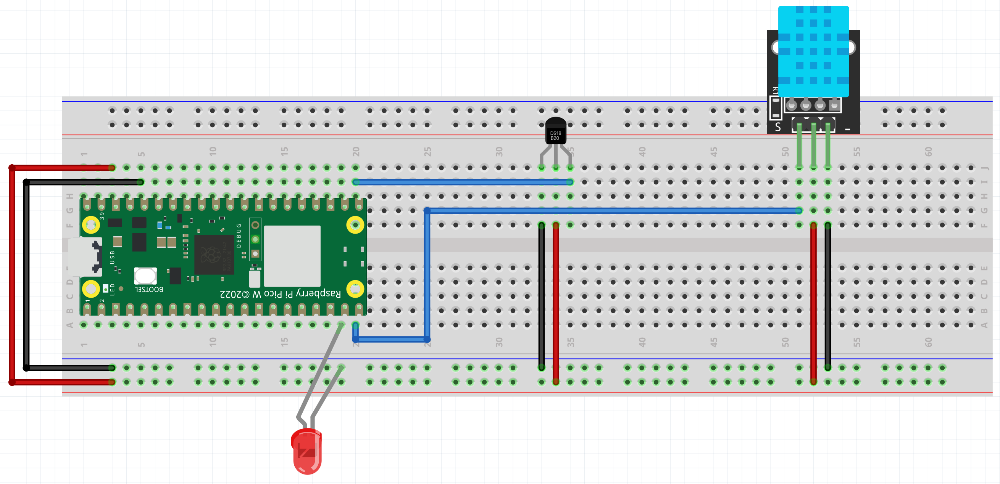

# Tutorial on How to Build an Apartment Climate Monitor

## Overview

### Title

Tutorial on an Apartment Climate Monitor

### Your Name

Amol Kaushik (ak225as)

### Short Project Overview

This project involves building a device that can measure temperature and humidity levels. The device will be created using various sensors and a Raspberry Pi WH - and will transmit data to a platform for monitoring and analysis. Although you can incorporate any other microcontroller, but you would have to find the right WiFi module and program that part yourself.

### Estimated Time

Approximate time to complete: 5-6 hours

## Objective

### Why You Chose the Project

I chose this project because it offers practical insights into the internet of things; and sensors that I have not used before. I personally have used Arduinos and other microcontrollers extensively before but not with any form of wireless communications, so this was a fun insight into that aspect of IoT. I often try finding ways to accomodate my apartment for the perfect temperature for me and also my dog. He is a fluffy black Groenendael so I though why not make an automatic system that can adjust the temperature and humidity for him, since he is quite sensitive to the recent hot weather we've been having in southern Sweden. Unfortunately due to time restraints and my other school work taking up a lot of my time, I could not finish the project as I would like to. Currently I get the temperature and humidity from the sensors and send it to ThingSpeak, but I would like to add a relay to control a heater or a fan to adjust the temperature and humidity. I made it such that the ThingSpeak channel is public so you can see the data [here](https://thingspeak.com/channels/2583390).

Ideally what I want for this project is that after the "feels like" temperature reaches some predefined threshold, the PI sends a Telegram update to me and my partner about the temperature and conditions at home, if we're not around. It would be a fun project to work on and I would like to finish it in the future. It would also send updates to us if any action has been taken to adjust the indoor climate. It would also alert about severe conditions through a telegram channel.

### What Purpose Does it Serve

The device can be used for environmental monitoring, helping to maintain optimal conditions in various settings, such as homes or wherever you want it to be.

### What Insights You Think it Will Give

By collecting data on temperature and humidity, the project will provide insights into environmental patterns and help in understanding how these factors vary over time and through seasons and the day. It is a cheap way to get a climate monitor for your home or apartment, and it can be expanded to include more sensors and more control over the indoor climate; and also through notifications and display directly on personal phones through services like Telegram bots.

## Material

### List of Material

- DHT11 Temperature and Humidity Sensor - Specifications: Measures temperature and humidity
- DS18B20 Digital Temperature Sensor - Specifications: Digital temperature sensor
- Raspberry Pi Pico
- Wires
- Breadboard
- USB Cable
- Resistors (if needed)

### Specifications and Cost

- **DHT11 Temperature and Humidity Sensor:** Measures temperature and humidity; bought from [Electrokit](https://www.electrokit.com/en/digital-temperatur-och-fuktsensor-dht11), cost: 49 kr.
- **DS18B20 Digital Temperature Sensor:** Measures temperature; bought from [Electrokit](https://www.electrokit.com/en/temperatursensor-ds18b20), cost: 42 sek.
- **Raspberry Pi Pico:** Microcontroller; bought from [Electrokit](https://www.electrokit.com/en/raspberry-pi-pico-wh), cost: 109 sek.
- **Wires, Breadboard, Resistors:** Various; bought from [Electrokit](https://www.electrokit.com/en/labbsladd-20-pin-15cm-hane/hane), cost: 29 sek.

### Example

In this project, I have worked with the Raspberry Pi Pico WH. It's a compact device programmed with MicroPython and has built-in WiFi capabilities, making it well-suited for this IoT project.


*Raspberry Pi Pico WH.*

## Computer Setup

### Chosen IDE

Thonny IDE for uploading and actually running code on macOS, and VS code for a nicer UI and for GIT integration.

### How the Code is Uploaded

1. Install Thonny IDE from [thonny.org](https://thonny.org/).
2. Connect the Raspberry Pi Pico to your computer via USB.
3. In Thonny, select the Raspberry Pi Pico as the interpreter.
4. Open your MicroPython code in Thonny.
5. Save the code to the Raspberry Pi Pico as `main.py` and `boot.py`.

### Steps Needed for Your Computer

- Installation of Thonny IDE
- Installation of necessary libraries for MicroPython (e.g., `umqtt.simple`)

## Putting Everything Together

### Circuit Diagram



### Step-by-Step Instructions

1. Preparing the Breadboard

    - Place the Raspberry Pi Pico on the breadboard with the pins inserted into the holes.

2. Connecting the DHT11 Sensor

    - The DHT11 sensor has four pins: VCC, Data, NC (Not Connected), and GND.
    - Connect the VCC pin of the DHT11 to the 3.3V pin on the Raspberry Pi Pico (Pin 36 or 3V3(OUT)).
    - Connect the GND pin of the DHT11 to a GND pin on the Raspberry Pi Pico (Pin 38 or any other GND pin).
    - Connect the Data pin of the DHT11 to GPIO 14 on the Raspberry Pi Pico (Pin 19).

3. Connecting the DS18B20 Sensor

    - The DS18B20 sensor has three pins: VCC, Data, and GND.
    - Connect the VCC pin of the DS18B20 to the 3.3V pin on the Raspberry Pi Pico (Pin 36 or 3V3(OUT)).
    - Connect the GND pin of the DS18B20 to a GND pin on the Raspberry Pi Pico (Pin 38 or any other GND pin).
    - Connect the Data pin of the DS18B20 to GPIO 15 on the Raspberry Pi Pico (Pin 20).

4. Connecting the Raspberry Pi Pico to the Computer

    - Use the USB cable to connect the Raspberry Pi Pico to your computer. This cable will provide power to the board and allow you to upload the code. Once the code is uploaded you can use any USB power source to power the Pico. For example a phone charger with a USB outlet.

### Electrical Calculations

Ensure the sensors are connected to the correct pins on the Raspberry Pi Pico, and use appropriate resistors if necessary to limit current and protect the components. The components listed come with their own resistors soldered on the PCB, so there is no need for resistors unless you use the components by themselves, bought from other sources.

## Platform

### Describe Your Choice of Platform

The data is transmitted to ThingSpeak, a cloud-based platform. ThingSpeak offers free and paid subscriptions. For this project, a free subscription is enough. So you can create an account using any email address and create a channel to receive the data from the Raspberry Pi Pico. When you create the channel, take note of the channel ID and the write API key, as these will be used in the code to send data to the channel.

Next once you have an account, you can create a new channel and add fields to it. You should add fields for temperature, humidity, heat index in CSV format. You can also set up visualizations and alerts based on the data received. I use a public channel for this project so you can see the data [here](https://thingspeak.com/channels/2583390). You can see I have a widget showing the heat index using a feels like temperature I calculates using [this](https://en.wikipedia.org/wiki/Heat_index#Formula) formula.

Next to create the MQTT device that will recieve information from your PI. Click on add device and select the channel that corresponds to your ThingSpeak channel. It is quite self explanatory and you can follow the instructions on the website. You will get a MQTT username and password that you will use in the code to connect to the ThingSpeak MQTT broker, take note of all the credentials:

1. MQTT_CLIENT_ID
2. MQTT_USERNAME
3. MQTT_PASSWORD
4. MQTT_SERVER = 'mqtt3.thingspeak.com'
5. MQTT_PORT = 1883

### Platform Functionality and Choice

ThingSpeak allows for real-time data collection, visualization, and analysis. Its ease of use and features make it a good choice for this project. It is also free to use and has a good API for sending data to it. It also has a MQTT broker that you can use to send data to it. It is also easy to set up and use, and you can create a channel and start sending data to it in a matter of minutes. I would like to implement my own stack but had limitations on the time I could spend on this project.

## The Code

The code itself is quite simple and the functions are named according to what they do. This code connects a Raspberry Pi Pico to WiFi and reads data from two temperature sensors (DS18B20 and DHT11) and a humidity sensor (DHT11). It calculates the heat index based on the temperature and humidity readings. The data is then sent to the ThingSpeak cloud platform via MQTT for monitoring and analysis. The onboard LED and an external LED are used to provide visual feedback for WiFi connection status and data transmission.

### Core Functions

```python
import network
import time
from simple import MQTTClient
import machine
import onewire
import ds18x20
import dht

# wifi credentials
SSID = ''
PASSWORD = ''

# Thingspeak MQTT settings
MQTT_CLIENT_ID = ''
MQTT_USERNAME = ''
MQTT_PASSWORD = ''
MQTT_SERVER = 'mqtt3.thingspeak.com'
MQTT_PORT = 1883
CHANNEL_ID = ''
WRITE_API_KEY = ''

# init DS18B20
ds_pin = machine.Pin(16)
ds_sensor = ds18x20.DS18X20(onewire.OneWire(ds_pin))

# init onboard led
led = machine.Pin('LED', machine.Pin.OUT)
# init external led
status_led = machine.Pin(14, machine.Pin.OUT)

# init DHT11 sensor
dht_sensor = dht.DHT11(machine.Pin(15))

# to blink the led
def blink_led(pin, times, interval):
    for x in range(times):
        pin.value(1)
        time.sleep(interval)
        pin.value(0)
        time.sleep(interval)

# to connect to wifi
def connect_to_wifi():
    wlan = network.WLAN(network.STA_IF)
    wlan.active(True)
    wlan.connect(SSID, PASSWORD)
    
    while not wlan.isconnected():
        print("Connecting to wifi...")
        blink_led(led, 1, 0.2)  # Blink rapidly
        time.sleep(1)
    
    print("Connected to wifi")
    led.value(1)  # Turn led on solid
    time.sleep(2)  # led on for 2 seconds
    led.value(0)  # Turn led off

def read_temperature():
    try:
        roms = ds_sensor.scan()
        if not roms:
            raise Exception("No DS18B20 sensors found")
        ds_sensor.convert_temp()
        time.sleep_ms(750)
        for rom in roms:
            temp = ds_sensor.read_temp(rom)
            return temp
    except Exception as e:
        print(f"Error reading temperature: {e}")
        blink_led(status_led, 5, 0.2)  # Blink rapidly for error indication
        return None

def read_dht11():
    try:
        dht_sensor.measure()
        return dht_sensor.temperature(), dht_sensor.humidity()
    except OSError as e:
        print('Failed to read DHT11 sensor.')
        return None, None

# this is used to approximate the heat index of the apartment 
def calculate_heat_index(T, RH):
    c1 = -8.78469475556
    c2 = 1.61139411
    c3 = 2.33854883889
    c4 = -0.14611605
    c5 = -0.012308094
    c6 = -0.0164248277778
    c7 = 0.002211732
    c8 = 0.00072546
    c9 = -0.000003582

    HI = (c1 + (c2 * T) + (c3 * RH) + (c4 * T * RH) + 
          (c5 * T**2) + (c6 * RH**2) + (c7 * T**2 * RH) + 
          (c8 * T * RH**2) + (c9 * T**2 * RH**2))
    return HI

def mqtt_connect():
    client = MQTTClient(MQTT_CLIENT_ID, MQTT_SERVER, port=MQTT_PORT, user=MQTT_USERNAME, password=MQTT_PASSWORD, keepalive=60)
    client.connect()
    print("Connected to MQTT Broker")
    return client

def send_to_thingspeak(client, temp, humidity, heat_index):
    try:
        topic = f'channels/{CHANNEL_ID}/publish'
        payload = f'field1={temp}&field2={humidity}&field3={heat_index}&status=MQTTPUBLISH'
        blink_led(status_led, 2, 0.5)  # Blink slowly
        client.publish(topic, payload)
        print(f"Data sent to ThingSpeak: Temperature={temp}, Humidity={humidity}, Heat Index={heat_index}")
        status_led.value(1)  # Turn led on solid
        time.sleep(1)  # led on for 1 second
        status_led.value(0)  # Turn led off
    except Exception as e:
        print(f"Failed to send data: {e}")
        # Blink rapidly for failure
        blink_led(status_led, 5, 0.2)
        # Attempt to reconnect
        client.disconnect()
        client.connect()

# Main program
connect_to_wifi()
client = mqtt_connect()

while True:
    temp_ds = read_temperature()
    temp_dht, humidity_dht = read_dht11()
    
    # Check if both sensors returned valid values
    if temp_ds is not None and temp_dht is not None and humidity_dht is not None:
        print(f"DS18B20 Temperature: {temp_ds}")
        print(f"DHT11 Temperature: {temp_dht}, Humidity: {humidity_dht}")
        heat_index = calculate_heat_index(temp_dht, humidity_dht)
        print(f"Heat Index: {heat_index}")
        send_to_thingspeak(client, temp_ds, humidity_dht, heat_index)
    else:
        print("Failed to read from one or both sensors.")
    
    time.sleep(15)  # ThingSpeak allows updates every 15 seconds

```

### Explanation of the LED Sequences

- **Connecting to WiFi:** The onboard LED blinks rapidly.
- **Connected to WiFi:** The onboard LED stays on solid for 2 seconds.
- **Sending Data to ThingSpeak:** The onboard LED blinks slowly twice.
- **Data Sent Successfully:** The onboard LED stays on solid for 1 second.
- **Failed to Send Data:** The onboard LED blinks rapidly five times.
